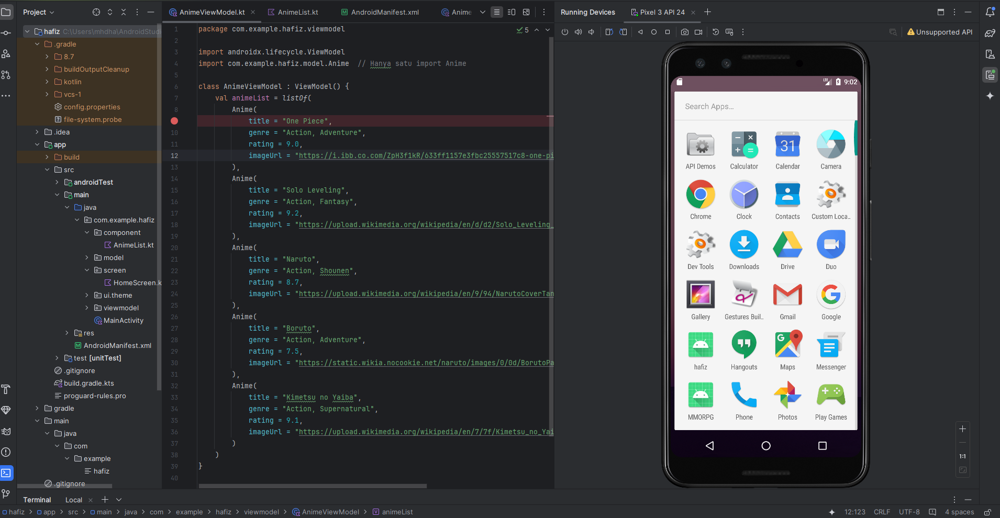

# BELAJAR BIKIN APLIKASI WEB MOBILE

## 📌 Overview
aplikasi Android yang menampilkan daftar anime beserta informasi seperti judul, genre, rating, dan gambar. Aplikasi ini menggunakan Jetpack ViewModel untuk mengelola data anime.

## 📸 Screenshot


## 🛠️ Tech Stack
- **Kotlin** - Bahasa pemrograman utama
- **Android Jetpack** - ViewModel untuk pengelolaan data
- **RecyclerView** - Untuk menampilkan daftar anime secara dinamis


## 📜 Fitur Utama
- Menampilkan daftar anime dengan gambar
- Menyediakan informasi judul, genre, dan rating
- Menggunakan ViewModel untuk pengelolaan data
# Anime App

## 📸 Screenshot


## 🛠️ Tech Stack
- **Kotlin** - Bahasa pemrograman utama
- **Android Jetpack** - ViewModel untuk pengelolaan data
- **RecyclerView** - Untuk menampilkan daftar anime secara dinamis

## 📂 Project Structure
```
app/
├── src/
│   ├── main/
│   │   ├── java/com/example/hafiz/
│   │   │   ├── component/     # Komponen UI
│   │   │   ├── model/         # Model data Anime
│   │   │   ├── screen/        # Layar utama
│   │   │   ├── ui/theme/      # Tema aplikasi
│   │   │   ├── viewmodel/     # ViewModel untuk pengelolaan data
│   │   │   ├── MainActivity.kt
│   │   ├── res/
│   │   │   ├── AndroidManifest.xml
│   │   ├── build.gradle.kts
│   ├── test/                  # Unit tests
│   ├── androidTest/           # Instrumented tests
```

## 📜 Fitur Utama
- Menampilkan daftar anime dengan gambar
- Menyediakan informasi judul, genre, dan rating
- Menggunakan ViewModel untuk pengelolaan data

## 🚀 Cara Menjalankan
1. Clone repositori ini:
   ```sh
   git clone https://github.com/tonjennn/belajar-mobdev
   ```
2. Buka proyek di **Android Studio**
3. Jalankan aplikasi menggunakan emulator atau perangkat fisik

## 🤝 Kontribusi
Jika ingin berkontribusi, silakan buat **pull request** atau buka **issue** baru.

## 📄 Lisensi
Proyek ini dilisensikan di bawah **MIT License**. Lihat file `LICENSE` untuk detail lebih lanjut.


